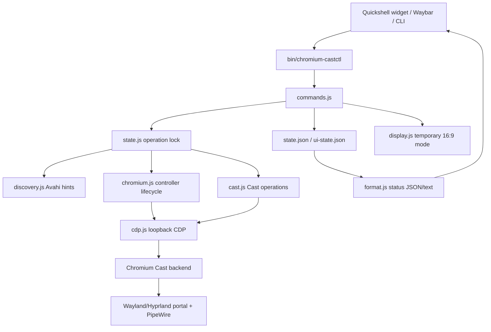
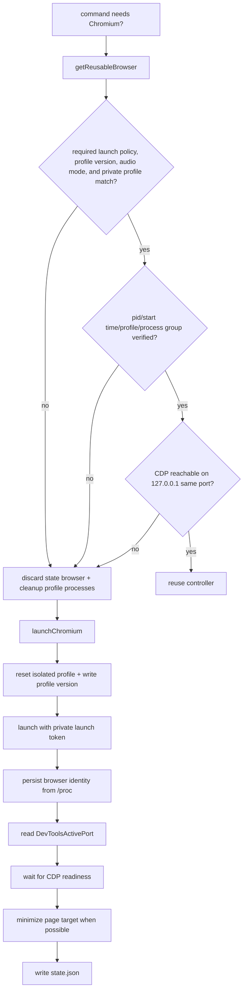
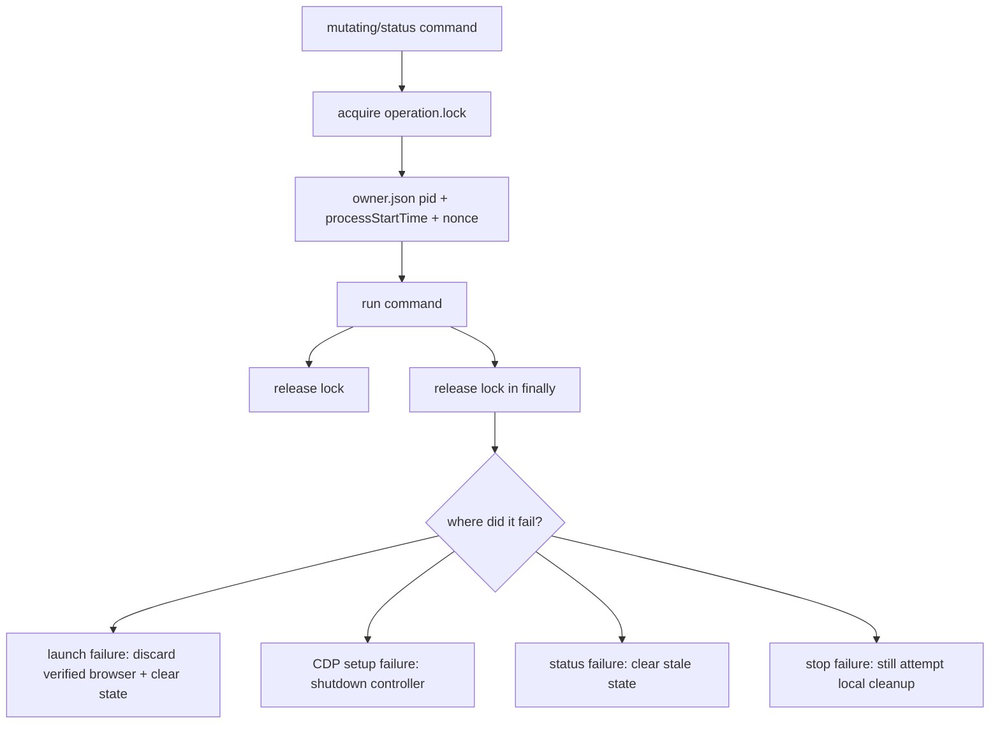
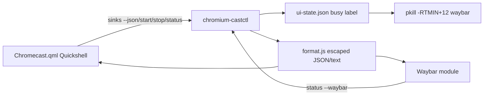

# chromium-castctl helper architecture

`chromium-castctl` is intentionally dependency-free and public-marketplace friendly. The executable in `bin/chromium-castctl` is only a thin CLI wrapper; the implementation lives in `lib/chromium-castctl/` so review can focus on one responsibility at a time.

## Module map

| Module | Responsibility | Security boundary |
| --- | --- | --- |
| `commands.js` | CLI parsing, command dispatch, state-lock scope, background helper spawning | Decides which commands may mutate local controller state |
| `state.js` / `paths.js` / `fs-private.js` | Private XDG paths, atomic state writes, busy UI state, operation lock | Local state ownership, symlink/non-directory refusal, lock ownership |
| `display.js` | Focused Hyprland monitor inspection, temporary 16:9 mode selection, exact configuration restoration | Validated compositor data and private restore state before runtime display changes |
| `process-identity.js` / `chromium-processes.js` | `/proc` identity reads, launch identity records, verified process matching | Process ownership before reuse or signaling |
| `chromium.js` | Isolated profile lifecycle, Chromium startup/reuse/cleanup, DevTools readiness | Private profile, loopback DevTools address, failure cleanup |
| `cdp.js` | Bounded CDP HTTP/WebSocket client, page target lookup, CDP URL validation | CDP access is loopback-only and size-limited |
| `discovery.js` / `sinks.js` | Avahi parsing, receiver normalization, duplicate/ambiguous target handling | Receiver names and ids are untrusted input |
| `cast.js` | `Cast.*` CDP operations and cleanup on CDP setup failure | Single place that starts/stops desktop mirroring |
| `status.js` / `format.js` / `doctor.js` | Status collection, Waybar JSON/terminal output, diagnostics | UI protocol escaping and stale-state reporting |

Installer and validation support remains outside the Node helper: `install.sh`, `scripts/validate-plugin.sh`, `scripts/check-actions-pinned.sh`, and `test/fixtures/dummy-chromium-cast` exercise packaging and workflow behavior without adding runtime dependencies.

## End-to-end flow

## Discovery and selection

1. Quickshell calls `chromium-castctl sinks --json`; legacy CLI/Waybar can call `pick` or `sinks`.
2. `commands.js` acquires the operation lock before commands that inspect or mutate controller state.
3. `pick` asks `discovery.js` for Avahi `_googlecast._tcp` hints first. Avahi results are only hints; Chromium discovery remains authoritative before casting.
4. `sinks.js` normalizes every receiver name/id, rejects control and bidi record-boundary characters, caps list/name/id lengths, and marks duplicate friendly names ambiguous instead of silently selecting one.
5. Quickshell consumes structured JSON. Legacy Walker input is generated only after normalization and ambiguity checks.

## Chromium controller lifecycle

`chromium.js` launches a headless controller with `--user-data-dir=<private profile>`, `--remote-debugging-address=127.0.0.1`, `--remote-debugging-port=0`, and a 1920x1080 virtual screen/window so Chromium does not clamp Cast capture to its 800x450 headless default. The browser receives a private `XDG_CONFIG_HOME`, and standard Chromium user-flag environment variables are removed before launch, isolating normal per-user flags and extensions without claiming to override system policy or arbitrary custom wrappers. A separate launch-configuration version prevents new casts from reusing an older launch policy; status and stop operations may still attach to that verified older controller so an upgrade-time status poll does not terminate an active cast. `chromium-processes.js` records both the configured executable and observed browser executable/device/inode during startup so later cleanup can distinguish the helper's controller from unrelated processes spoofing a profile argument. Flattened `/proc/<pid>/cmdline` cleanup additionally requires the private launch record because its original argv boundaries cannot be reconstructed safely.

## CDP connection and Cast operations

- `cdp.js` fetches `/json/list`, creates an `about:blank` page if needed, and accepts only `ws://127.0.0.1:<expected-port>/...` CDP WebSocket URLs without credentials.
- HTTP responses and WebSocket messages are bounded so hostile or broken CDP responses fail deterministically.
- `cast.js` is the only module sending `Cast.enable`, `Cast.startDesktopMirroring`, or `Cast.stopCasting`.
- `start` updates `lastActiveSink` only after Chromium accepts `Cast.startDesktopMirroring`. The Wayland portal prompt is still owned by Chromium/xdg-desktop-portal-hyprland and is not bypassed.
- Immediately before the Cast start request, `display.js` may persist the focused monitor's mode, position, scale, and transform, then use Hyprland's Lua `hl.monitor` runtime API to select the closest supported 16:9 mode, preferring 1920x1080. Unsupported displays and non-Hyprland sessions are left unchanged.
- `stop` tries every active sink, clears local active state, then closes the isolated Chromium controller even if one stop request fails.

## State, locks, and failure cleanup

State files are private to the user under XDG data/state/cache roots. Atomic writes go through `fs-private.js`, directories are created with private permissions, and unsafe non-directory/symlink paths are refused where the helper creates private directories. Locks with a verified owner are stale only when that process is gone or no longer has the recorded start time; incomplete or invalid lock records are reclaimed only after the stale timeout.

Display restore state is written before the temporary mode is applied. Browser shutdown, failed Cast start, explicit quit, and idle/stale status cleanup all attempt idempotent restoration; the state file remains available for a later retry if Hyprland cannot apply the saved configuration.

Security-relevant parse and lifecycle errors use explicit error classes/codes from `errors.js` rather than message-text matching. For example, an oversized `DevToolsActivePort` file is classified as `cdp_devtools_active_port_too_large`, and wait logic branches on that sentinel code.

## UI data flow

Quickshell should continue to consume `sinks --json`; newline-delimited receiver names are legacy UI input only after normalization. Waybar JSON escapes receiver text for tooltip/text fields and renders busy state from `ui-state.json` without launching Chromium.

## Dependency-free tradeoffs

Avoiding runtime npm dependencies helps marketplace review: there is no package lock to audit, no transitive supply-chain drift, and the helper can run from a plugin checkout with only Node, Chromium, Avahi, and the desktop portal stack installed.

The tradeoff is that the helper owns small local implementations that dependencies might otherwise provide: atomic file writes, process identity checks, lock takeover, bounded HTTP response reads, WebSocket RPC bookkeeping, receiver normalization, and terminal/UI escaping. These local pieces must stay small, tested, and easy to inspect; do not broaden them into general-purpose frameworks.

Responsibilities intentionally delegated outside this project:

- Chromium: Google Cast discovery inside the browser, media routing, CDP Cast implementation, and the desktop capture request.
- xdg-desktop-portal-hyprland / Omarchy / PipeWire: user consent, screen selection, capture transport, and shell UI hosting.
- Avahi: fast mDNS hints only, never final casting authority.
- Waybar/Quickshell: rendering the helper's already-escaped or structured status output.
